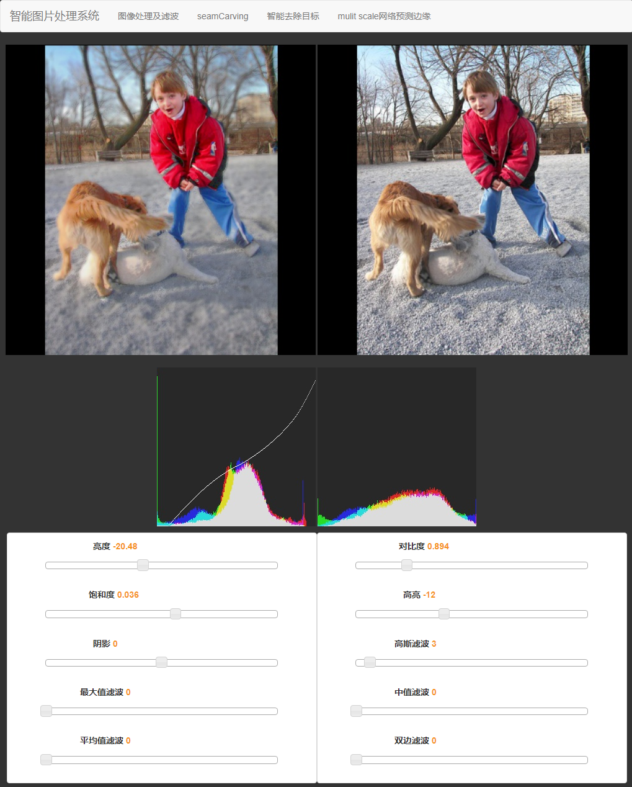
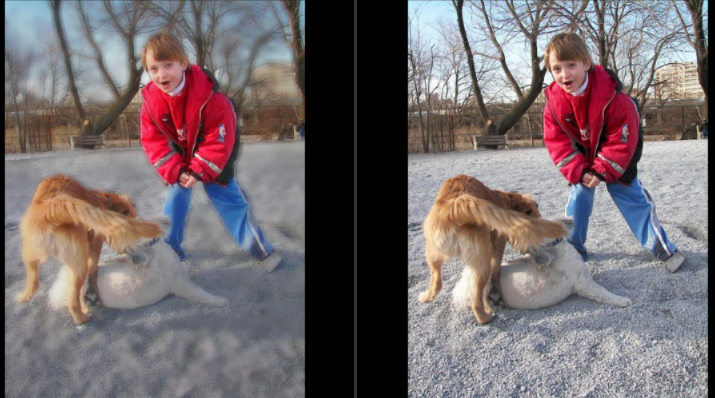
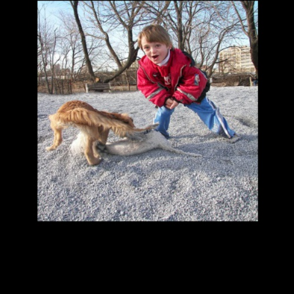
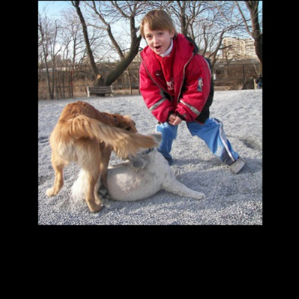
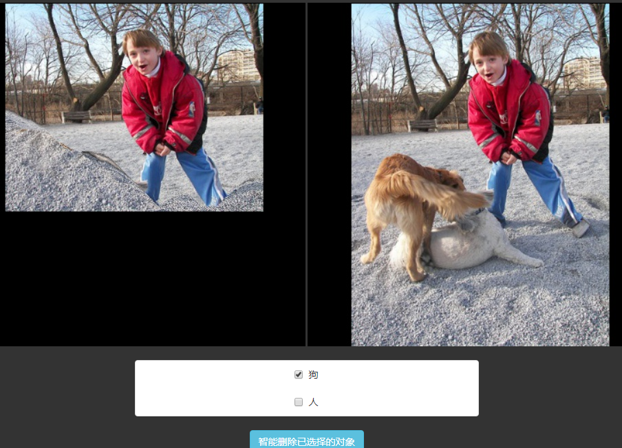

## 最近做了

* 完成了*智能图片处理系统* 并给老师检查

* 实现高斯 中值 双边等图像滤波(滤镜)算法

* 将之前写的显著性算法与图像处理模块结合 实现前景 背景自动分离 分开处理

* 实现了图像压缩算法 [seam carving](https://en.wikipedia.org/wiki/Seam_carving)

(压缩50排像素)

* 将显著性算法与seam carving结合 达到更优的压缩效果

* 配了一个基于caffe的精细语义分割方法 [`SEC`](https://github.com/kolesman/SEC) 将语义信息与seam carving 结合 实现智能去除目标

* 实现了BP神经网络的前向计算

* 了解了一下符号计算库sympy

* 完成数字图像处理的作业 频率域的模板匹配

* 制作了一份简单的[简历](http://diyer22.github.io/project/curriculumVitae/print.html)

* 参观了北服的工业设计系 数字媒体艺术系的毕业设计展

* 去北区和社团的伙伴们聚餐

* 观看电影
> * 《海边的曼切斯特》冷静的镜头 克制的情绪 然而 凯西的煎熬和恍惚 依然弥漫着整个屏幕
> * 《釜山行》远低于期望 看完后很失望

## 将要

* 完成BP神经网络反向传播

* 软件工程课设善后

* 完成就业指导课作业

* 调研数字图像处理大作业 一种基于图像处理的屈光度测量方法

## Summary

虽然事情也很多 但没有四月初那么地忙了
