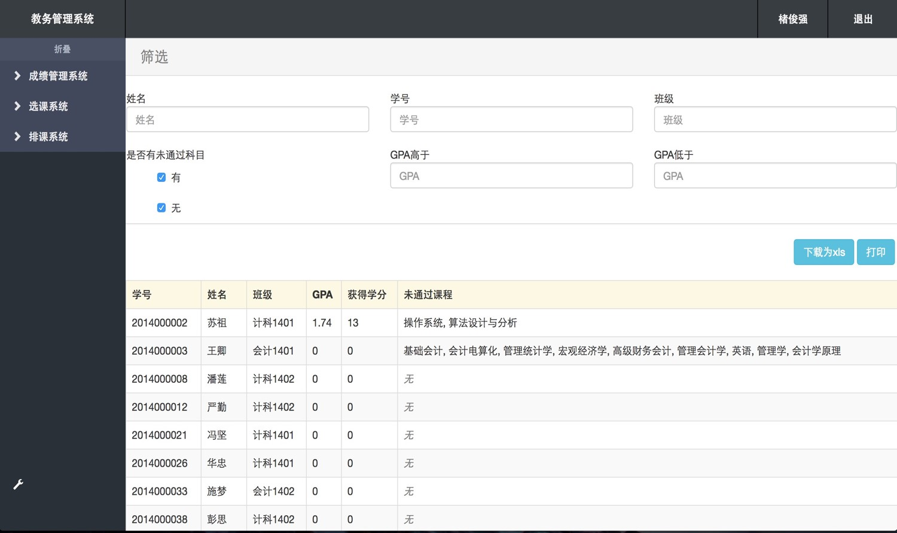

## 最近做了

* 实现了反向传播算法，并完成了 [BP神经网络](https://github.com/DIYer22/Backpropagation)

* 实现了一个基于Chrome插件的爬虫

>优点
1. 无需构造复杂的请求与登陆
2. 可以用jQuery选择器解析数据

>不足

> 1. 由于页面经过渲染 消耗系统资源 无法大规模多线程爬取
2. 自动化程度不够，现在的构架稳定性差，得改一改

* 学习了数据处理工具 pandas

* 给软件工程课设添加了多个条件筛选功能

>

> 当写完这个组件，测试的时候，一次性通过，心里特别畅快

* 复习《人工智能导论》完成考试

> 了解了 启发式搜索、推理机、模糊推理等 传统的人工智能方法，也进一步了解了机器学习的发展历程

* 复习《数字媒体技术》完成考试

> 这学期最喜欢的课，胡伟老师是一个有洞见且乐于分享的人。就是课时太短了，只上8周就结束了

* 完成4000字的就业指导课作业

* 做了体测

| 体测项目        | 大一   |  大二  | 大三 |
| --------   | :-----:  | :----:  | :----:  |
| 1000m     | 3分20秒 |  3分25秒|  3分29秒|
| 50m        |   6.2 s    |   7.1 s    |  6.9 s    |
| 引体向上  |     18 个    |   26 个 |   28 个 |
| 跳远        |    2.60 m     | 2.65 m   | 2.65 m   |
| 体前驱       |    5 cm     |  10 cm  | 15 cm  |

## 将要

* 休整与休息

* 优化爬虫

* 继续学习和使用pandas

* 学习信息论

## Summary

* 软件工程课设让我们还没出校园就成了码农, 免费的那种

* 当我越能掌控生活时 就会更加理想主义，而越忙碌时 则更加现实 也更不愿思考，在两种状态中循环,影响着我的选择

* 面临重大决策时，我会觉得自己缺乏社科知识，待到能掌控生活节奏的时候，一定要多补社科基础知识
