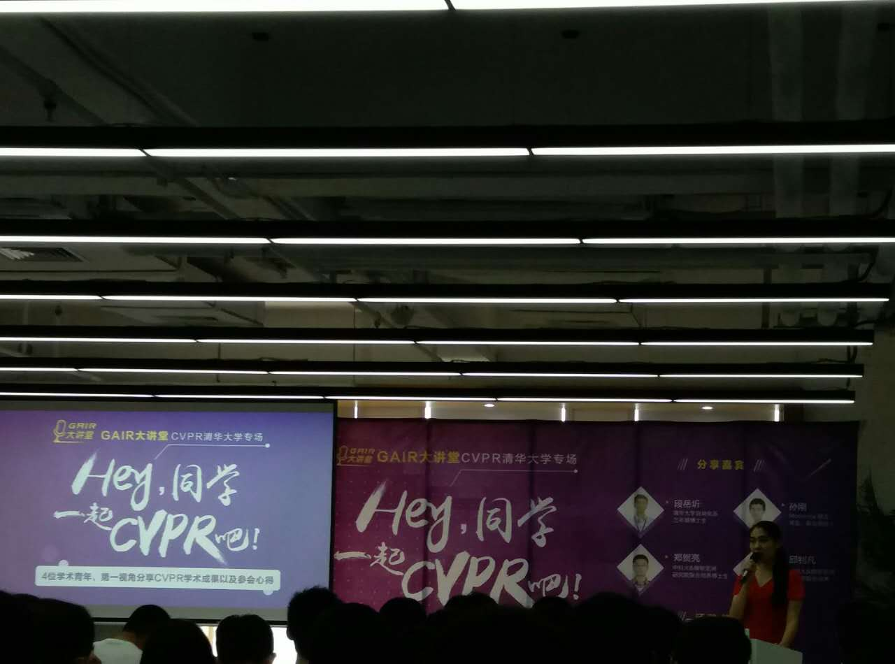

## 最近做了

* 去清华参加了一个雷锋网举办的活动：[GAIR大课堂-CVPR清华专场](https://www.leiphone.com/activity/view/id/2)

* SegNet应用在海陆分割问题
> caffe 很不灵活 太难用了

* 和实验室两个师兄协同 做了旷世校招的   [第三道 隐藏关卡 Test 3 ](http://mp.weixin.qq.com/s/2AzCWmhvyTFoJronYXjUAw)

* 将师兄用MXnet写的 res-Unet网络应用在 Kaggle比赛：[Carvana Image Masking Challenge](https://www.kaggle.com/c/carvana-image-masking-challenge) 中, 排名200多

* 修改了一下简历：[杨磊的简历](http://diyer22.github.io/project/cv/)

## 将要

* 做一个图像机器学习周边工具库，主要作用是数据预处理和预测结果分析

* 学习TensorFlow

## Summary

最近实验跑得比较多 感觉代码越来越难以控制 有一个统一的处理过程尤为重要
