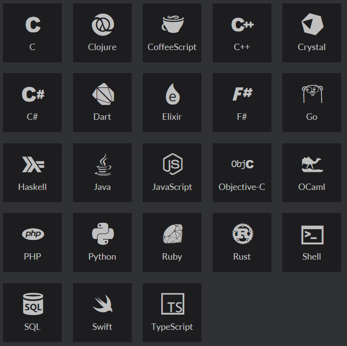
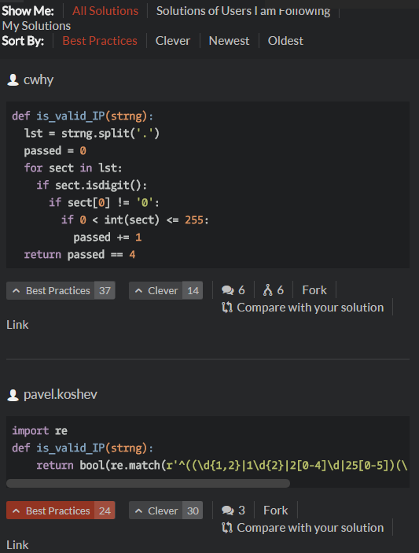
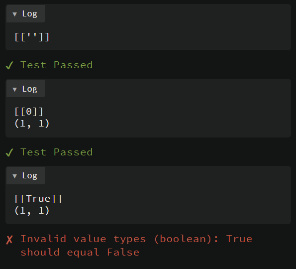
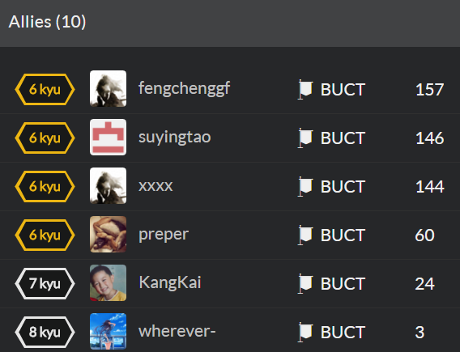
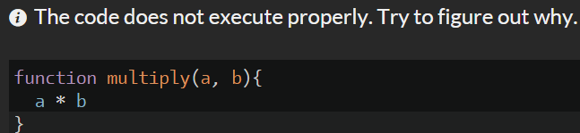

# 一个超赞的练习编程的网站

---

*Achieve code mastery through challenge*

如果是从微信公众上看到此文章
为了使http链接有效
建议长按二维码或阅读原文 跳转到github版本：
https://github.com/DIYer22/MyMarkDown/

## Codewars的优点有：

### 支持几乎所有常见语言(甚至SQL)

### 良好的代码展示 能够快速学习大神的编码技巧 及解题思路

做完一道题目后 会自动跳转到solutions界面

显示这道题所有人的代码

可以按照票数多少、时间、以及自己所关注的人来进行筛选排序

默认是按照投票数排序，所以可以快速学习牛逼的代码

你也可以参与投票以及被别人投票

点击`Compare with your solution`可将选中的代码与你写的进行对比

比如说这道题 做完后 被大神给震住了[&lt; 6  kyu&gt;Sum of Digits / Digital Root](https://www.codewars.com/kata/541c8630095125aba6000c00)

### 白箱OJ 减少浪费的时间 快速找出BUG

Codewars会原汁原味地展示你的打印内容以及错误信息  

而不是泛泛而谈的 `Runtime Error`或`Wrong Answer`

意味着你能用(printf,print,console.log) Log出输入内容和运行时候的任何变量

由于有详细的错误信息 Debug也会更加顺畅

像这种坑货 要是没有白箱 可能就是提交十几次就放弃了 什么也没学到 还浪费了时间

### 可以在手机上刷的 OJ
只需源码+服务器端编译运行+完整的错误与log显示
让Codewars 在手机上也能流畅地刷OJ
（PS:在手机上，刷OJ总比刷 微信/QQ/微博/知乎 好）

由于网页结构较为复杂
有些手机浏览器支持不佳
建议多试几个 然后选择一个体验最好的(我选择的 Opera )
ps:手机刷题的时候 刷点简单的题就好 比如 5 kyu 难度以下的

### 不错的队伍设计及基础，友好的社交功能
申请的时候在队伍(Clan)填写`BUCT` 就能看到这些盟友(Allies)

### 可以成为良好的编程技能的背书

### 全因英文的界面和题目 能够提高英语能力

### 提供API 可以通过

## 新手 Tips：
* 一般注册的时候会叫你补全一段缺少return的代码，把return写上就好啦

* 填写队伍(Clan)的时候填学校的英文缩写 `BUCT` 这样就能找到所有`BUCT`的队友了

* 建议在浏览器上面安装一个划词翻译的插件，我用的这个开源的[划词翻译](https://chrome.google.com/webstore/detail/%E5%88%92%E8%AF%8D%E7%BF%BB%E8%AF%91/ikhdkkncnoglghljlkmcimlnlhkeamad?utm_source=chrome-app-launcher-info-dialog)

* 如果想在手机上刷题 建议再买一个手机蓝牙键盘

* 想找哪一道题 或练习哪一种题 请用google 的 site 指令 比如：搜索`graph site:codewars.com`

* 如果网页加载太慢 请把`codewars.com`加入`Shadowsocks`的PAC列表中 走代理

---

> 时间：`2017/03/08`

> 作者：`小磊`

> 邮箱：`ylxx@live.com`
